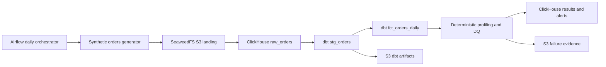
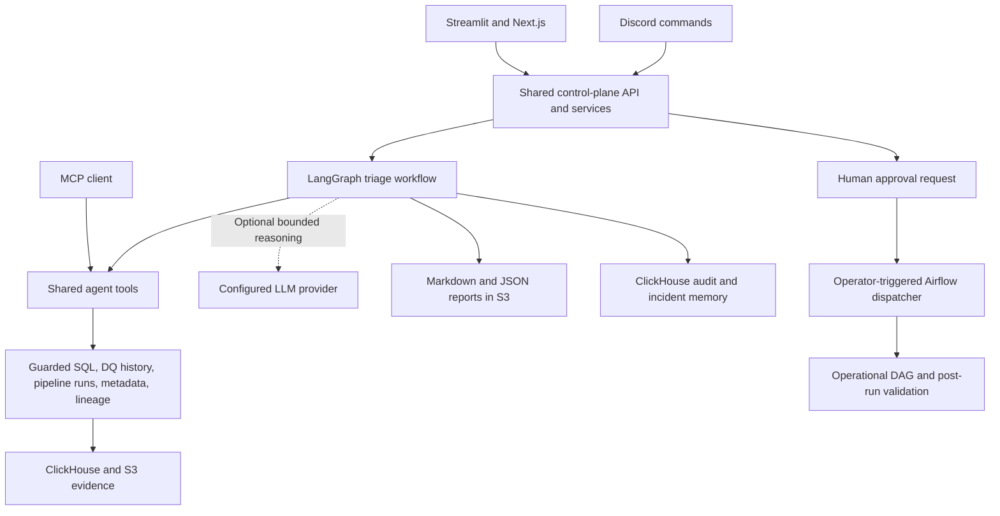
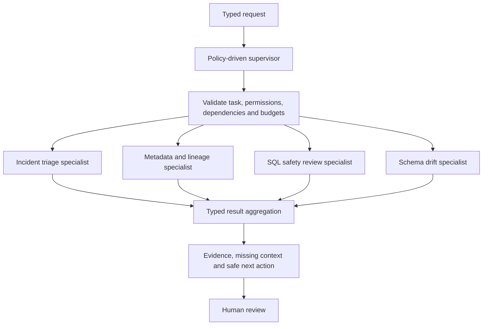
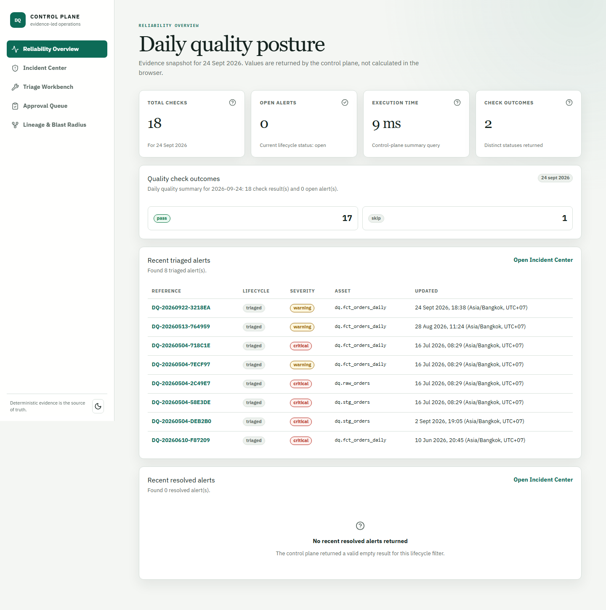
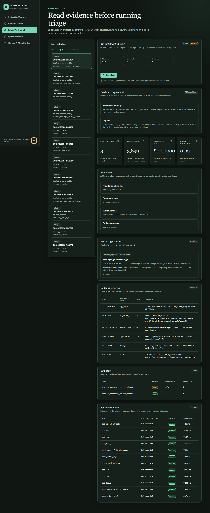
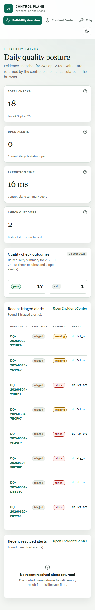

<!--
Agentic Data Quality Triage
Author: Mario Caesar // hello@caesarmar.io // https://caesarmar.io/
-->

<h1 align="center">🛡️ Agentic Data Quality Triage</h1>
<p align="center"><b>Data Reliability Control Plane for Warehouse Quality, Metadata Trust, and Agentic Incident Triage</b></p>
<p align="center">Detect unreliable warehouse data, investigate it with evidence, and review the next action.<br>Built with <b>Apache Airflow</b>, <b>SeaweedFS</b>, <b>ClickHouse</b>, <b>dbt</b>, and <b>LangGraph</b>, with local operator interfaces and optional LLM providers.</p>
<br>
<p align="center">
  <a href="https://github.com/caesarmario/agentic-data-quality-triage"></a>
  <a href="https://github.com/caesarmario"></a>
  <a href="https://beacons.ai/caesarmario_"></a>
  <a href="https://www.kaggle.com/caesarmario"></a>
  <a href="LICENSE"></a>
</p>
<br>

**Start here:** [Local setup](#local-setup) → [First demo](#first-demo-without-an-api-key) → [Inspect the evidence](#data-and-evidence-reference).

This is a **local, production-flavored reference implementation**, not a managed service or a claim of production certification. It uses synthetic orders so that failures, investigations, and backfills can be demonstrated without exposing customer data. The pipeline and a heuristic investigation path work without a paid API key. External LLM calls are opt-in.

## Contents

- [What this project does](#what-this-project-does)
- [Capability and acceptance boundaries](#capability-and-acceptance-boundaries)
- [Architecture](#architecture)
- [Stack and repository layout](#stack-and-repository-layout)
- [Local setup](#local-setup)
- [First demo without an API key](#first-demo-without-an-api-key)
- [Airflow operations](#airflow-operations)
- [Data and evidence reference](#data-and-evidence-reference)
- [Operator interfaces](#operator-interfaces)
- [Discord setup](#discord-setup)
- [LLM setup and cost controls](#llm-setup-and-cost-controls)
- [Metadata and schema drift](#metadata-and-schema-drift)
- [Bounded multi-agent runtime](#bounded-multi-agent-runtime)
- [MCP integration](#mcp-integration)
- [Testing and acceptance](#testing-and-acceptance)
- [Security and operational boundaries](#security-and-operational-boundaries)
- [Troubleshooting](#troubleshooting)
- [Stopping and restarting](#stopping-and-restarting)
- [Demonstration checklist](#demonstration-checklist)
- [Limitations and roadmap](#limitations-and-roadmap)
- [Glossary](#glossary)
- [Further reading](#further-reading)
- [Author and license](#author-and-license)

<!-- --- Explaining Product Scope -->
## What this project does

A successful ingestion job does not necessarily produce trustworthy data. A country-channel segment can disappear while every task remains green. A duplicate load can inflate revenue. A dashboard can look plausible while its partition is incomplete.

This project connects those problems to an operator workflow:

**Detect → Investigate → Explain → Review → Approve → Execute through controlled boundaries → Validate.**

1. Generate reproducible synthetic orders and land partitioned Parquet in S3-compatible storage.
2. Load ClickHouse raw data and build staging and daily marts with dbt.
3. Run profiling and deterministic quality checks; retain results and generate deduplicated alert identities.
4. Investigate an alert using DQ history, pipeline runs, metadata, lineage, and guarded SQL evidence.
5. Produce a readable report with hypotheses, evidence references, limitations, and a recommended action.
6. Let a human review a bounded backfill request. Approval and execution are separate events.
7. Inspect the new pipeline and quality results before claiming the issue is resolved.

The intended audience is data warehouse, analytics engineering, and data platform teams. The engineering focus is not just an AI answer: it is a repeatable path from a quality signal to an auditable decision.

## Capability and acceptance boundaries

| Capability | Available behavior | Boundary |
| --- | --- | --- |
| Daily data pipeline | Generator, S3 landing, raw load, dbt models, profiling, DQ, alerts | One synthetic orders domain; not a general-purpose ingestion service |
| Quality rules | Positive volume, completeness, accepted values, segment coverage, historical volume anomaly, duplicate and late-arrival rates, non-negative revenue | Rules are declared in the current contract; do not assume every industry DQ category is implemented |
| Agent triage | Evidence collection, hypothesis ranking, readable Markdown/JSON reports, audit trail | Evidence is authoritative; model prose is an interpretation |
| Metadata and lineage | Registry sync, asset discovery, dbt dependencies, bounded blast-radius lookup | Coverage depends on registry entries and uploaded dbt artifacts |
| Schema drift | Snapshots, comparison, severity, contract evidence | Detection is not permission to migrate a schema |
| Approvals | Durable requests, approve/reject/cancel, approved backfill dispatcher | An approved request is not an executed repair; cancellation does not stop a dispatched DAG |
| Interfaces | Streamlit, FastAPI, Discord, MCP, optional Next.js UI | Local operator surfaces, not enterprise SSO/RBAC |
| LLM integration | Provider-agnostic routes, no-key fallback, explicit provider smoke | A heuristic success does not prove a provider worked |
| Multi-agent | Typed specialist contracts, single handoff, opt-in bounded fan-out | No unrestricted recursive agents; paid parallel-worker acceptance remains separate |
| Evaluation | Scenario ground truth, LIFE-inspired evaluations and resilience checks | Improvement proposals require human review; no autonomous code or policy rewriting |

Historical acceptance records are linked under [Testing and acceptance](#testing-and-acceptance). They describe specific runs, not a guarantee that a different laptop, provider account, or fresh clone has already been tested. Browser layout, keyboard interaction, and hydration are not proven by HTTP smoke checks.

<!-- --- Explaining Architecture -->
## Architecture

### Data plane



### Investigation and operator flow



### Supervisor boundary



The diagram shows available specialists, not four agents automatically running for every question. Single-handoff execution is the default. Fan-out uses explicit task contracts and shared limits.

### Why these choices

- **Airflow** owns scheduling, dependencies, task retries, and retained operational logs. Agent reasoning does not replace orchestration.
- **ClickHouse** stores analytical orders, quality signals, and investigation evidence. PostgreSQL in this stack serves Airflow metadata, not the business warehouse.
- **SeaweedFS** provides a local S3-compatible landing and artifact store, including a filer UI for inspection. The application uses S3 APIs rather than requiring AWS or another specific object-storage product.
- **dbt** makes transformation logic, tests, and dependency artifacts inspectable.
- **LangGraph** coordinates workflow state and bounded investigations. Gemini, OpenAI, Groq, and xAI are provider backends, not replacements for that workflow layer.
- **Deterministic checks plus AI interpretation** keep the meaning of pass/fail independent from generated prose.
- **Streamlit plus an optional web UI** separates a practical internal console from a more product-oriented interface without duplicating the warehouse logic.
- **Explicit modular DAGs** keep the demo readable. Fully config-generated DAGs are not needed for one dataset.

## Stack and repository layout

| Component | Repository configuration | Responsibility |
| --- | --- | --- |
| Apache Airflow | 3.1.7, CeleryExecutor | Daily orchestration and manual acceptance DAGs |
| PostgreSQL / Redis | 16-alpine / 7.2-alpine | Airflow metadata, result backend, task broker |
| ClickHouse | 25.3-alpine | Warehouse and observability tables |
| CH-UI | v2.5.1 default image | Local warehouse inspection |
| SeaweedFS | 4.13 | S3 gateway, filer, volume and master services |
| Python | 3.11 runner image | Pipelines, API, bot, tools, evaluations |
| dbt-clickhouse | See requirements | Staging/mart transformations and tests |
| LangGraph / Pydantic | See requirements | Workflow state and typed contracts |
| Streamlit / FastAPI | See requirements | Operator console and shared API |
| Next.js / TypeScript / shadcn-style components | Optional web profile | Product-oriented operator UI |
| Discord / MCP | Optional integrations | Commands and tool access |

Exact Python dependencies are in [infra/requirements.txt](infra/requirements.txt); frontend dependencies are in [apps/web/package.json](apps/web/package.json). Image defaults and service relationships are defined in [infra/docker-compose.yml](infra/docker-compose.yml). These are repository pins, not claims about the latest upstream releases.

```text
agent/                 LangGraph workflow, LLM routes, specialists, tools, MCP, evaluation
apps/api/              FastAPI control plane
apps/common/           Shared interface clients and services
apps/discord_bot/      Discord commands and readable message formatting
apps/streamlit/        Internal operator console
apps/web/              Optional Next.js operator UI
configs/               Seeding, DQ, incidents, metadata, schema contracts, model routing
dags/                  Explicit operational and administrative DAGs
infra/                 Docker Compose, image definitions, SQL and S3 initialization
pipelines/             Generator, landing, loading, dbt, profiling, DQ
warehouse/dbt/         dbt project, models, tests and profiles
scripts/               Airflow trigger helpers, smoke checks and verification
tests/                 Deterministic unit, contract and integration-style tests
docs/                  Detailed designs, operator guides and retained acceptance records
data/                  Generated local landing files; not source data to commit
logs/airflow/          Retained task logs mounted from Airflow
```

<!-- --- Documenting Installation -->
## Local setup

### Prerequisites

- Git and Docker Engine with Docker Compose v2, or Docker Desktop using Linux containers.
- On Windows, a working Docker Desktop Linux/WSL2 backend and access to the checkout from Docker.
- Internet access for the first image/dependency build. No LLM account is required for the first demo.
- Enough free ports for the services below and permission to mount the checkout.
- As a **planning estimate, not a measured minimum**, allow 4 CPU cores, 8-12 GB available Docker memory, and 15-25 GB free disk. A host with 16 GB or more RAM is more comfortable for this multi-service stack.

Host Python, Node.js, and GNU Make are not required for the container-based walkthrough. Make targets are optional shortcuts for a POSIX-compatible shell. Use the explicit Docker commands on PowerShell.

> Run this stack on a trusted development machine. Several services publish host ports; only the web UI is explicitly bound to loopback by default. This Compose file is not a hardened public deployment. Read the [security boundary](#security-and-operational-boundaries) before exposing anything beyond your laptop.

### 1. Clone and create local configuration

PowerShell:

```powershell
git clone https://github.com/caesarmario/agentic-data-quality-triage.git
Set-Location agentic-data-quality-triage
if (-not (Test-Path infra/.env)) { Copy-Item .env.example infra/.env }
docker version
docker compose version
```

Bash:

```bash
git clone https://github.com/caesarmario/agentic-data-quality-triage.git
cd agentic-data-quality-triage
test -f infra/.env || cp .env.example infra/.env
docker version
docker compose version
```

If the Docker command only shows a client and cannot connect to a server, start Docker and wait for its Linux engine before proceeding. Do not overwrite an existing `infra/.env` during an upgrade.

### 2. Review configuration

Edit `infra/.env` locally. Never commit it or paste its full contents into logs or issues.

| Setting | Initial demo behavior |
| --- | --- |
| `TZ`, `AIRFLOW__CORE__DEFAULT_TIMEZONE` | Keep `Asia/Bangkok` |
| `EXTERNAL_LLM_ENABLED` | Keep `false` |
| `LLM_PROVIDER_MAX_RETRIES` | Keep `0` |
| Provider API keys | Leave blank for the first demo |
| `DISCORD_ALERT_WEBHOOK_URL` | Leave blank unless you deliberately want external notifications |
| `CONTROL_PLANE_APPROVAL_TOKEN` | Set a long random local secret before using approval mutation endpoints |
| `AIRFLOW_WWW_USER_PASSWORD` | Local login password; example value is not suitable for a shared host |
| `AIRFLOW__API_AUTH__JWT_SECRET` | Replace the demo value before first initialization; keep consistent across Airflow services |
| ClickHouse, AWS/S3 and Airflow database credentials | Local demo defaults only; update corresponding service configuration consistently |
| `AGENT_CHECKPOINT_MODE` | `off` for the first run; optional persistence is explained later |

Airflow uses SimpleAuthManager. The configured user specification is `admin:admin` and the initial password comes from `AIRFLOW_WWW_USER_PASSWORD`; the example password is `admin`. Initialization writes the password file under `infra/airflow/auth/`. Do not publish that directory's generated secrets.

ClickHouse uses the configured local user/password. SeaweedFS credentials are passed to the S3 clients; changing client environment variables alone must not be assumed to configure server-side S3 authorization. Keep this demo private.

For the reproducible baseline, retain database name `dq`: the initialization SQL explicitly creates objects in that database. The current `clickhouse-init` client connects as the default user without passing a password. Custom warehouse credentials require a corresponding bootstrap/client configuration review, not just editing one environment value. Do not interpret the environment example as turnkey production hardening.

### 3. Build and start

The following single-line commands work in both PowerShell and Bash, from the repository root:

```text
docker compose --env-file infra/.env -f infra/docker-compose.yml config --quiet
docker compose --env-file infra/.env -f infra/docker-compose.yml build dq-runner
docker compose --env-file infra/.env -f infra/docker-compose.yml up -d
docker compose --env-file infra/.env -f infra/docker-compose.yml ps -a
docker compose --env-file infra/.env -f infra/docker-compose.yml logs --tail 80 airflow-init clickhouse-init s3-init
```

Equivalent optional Make shortcuts: `make compose-check`, `make build-runner`, `make up`, `make ps`.

Wait for ClickHouse, the S3 gateway, Airflow API server, scheduler, DAG processor, worker, runner, and Streamlit to become ready. `airflow-init`, `clickhouse-init`, and `s3-init` are **one-shot initialization containers**: `Exited (0)` is expected after they finish. An exited nonzero init container is a problem and must be investigated before triggering DAGs.

The Celery worker delegates project commands to `dq_runner` through the Docker socket. Check that boundary before your first task:

```text
docker exec dq_airflow_worker sh -lc "command -v docker && docker version"
docker exec dq_runner python -c "import os; print('external_llm_enabled=' + os.getenv('EXTERNAL_LLM_ENABLED', 'false'))"
docker exec dq_airflow_scheduler airflow dags list-import-errors
docker exec dq_airflow_scheduler airflow dags list
```

Expected: a working worker Docker client/server connection, `external_llm_enabled=false`, no DAG import errors, and the project DAGs listed. If the worker image cannot find Docker or cannot access the socket, stop here. The stock image/socket integration must work on your installation; a healthy Airflow web page alone does not verify it. Do not solve this by making the socket world-writable.

### 4. Open the services

| Service | Default local address | Notes |
| --- | --- | --- |
| Airflow | [localhost:8080](http://localhost:8080) | Login configured above; business timezone is Asia/Bangkok |
| Streamlit | [localhost:8501](http://localhost:8501) | Core operator/debug console |
| CH-UI | [localhost:3488](http://localhost:3488) | Inspect tables and run read-only queries |
| ClickHouse HTTP | [localhost:8123](http://localhost:8123) | Query endpoint, not the operator dashboard |
| SeaweedFS Filer | [localhost:8888](http://localhost:8888) | Browse `/buckets` and stored objects |
| SeaweedFS Master | [localhost:9333](http://localhost:9333) | Storage topology/status |
| SeaweedFS S3 | [localhost:8333](http://localhost:8333) | S3 API endpoint, not a bucket-browser UI |
| Flower | [localhost:5555](http://localhost:5555) | Celery worker monitoring |
| FastAPI, optional | [localhost:8000/docs](http://localhost:8000/docs) | OpenAPI documentation |
| Next.js, optional | [localhost:3000](http://localhost:3000) | Product-oriented UI |

Host ports are configurable in `.env.example`. Inside Docker, applications use service DNS names such as `clickhouse`, `seaweed-s3`, and `api`, not host `localhost`.

### 5. Optional API and web UI

Start the API without the web UI:

```text
docker compose --env-file infra/.env -f infra/docker-compose.yml --profile api up -d api
```

Or build/start the web UI and its dependencies:

```text
docker compose --env-file infra/.env -f infra/docker-compose.yml --profile web up -d --build web
docker compose --env-file infra/.env -f infra/docker-compose.yml --profile web logs --tail 50 web api
```

The web container does not receive provider keys or warehouse credentials. It uses the API boundary. Set `CONTROL_PLANE_APPROVAL_TOKEN` in the local environment before using protected approval operations, and recreate the affected API/web services when changing their environment. Do not put this token in browser-visible `NEXT_PUBLIC_*` variables.

<!-- --- Walking Through the First Demo -->
## First demo without an API key

Allow extra time for the first image build. The workflow below is deliberately manual and uses synthetic partitions. It is not necessary to enable a daily schedule or buy API credit to demonstrate the platform.

### 1. Verify a zero-cost regression run

```text
docker exec dq_airflow_scheduler python /opt/airflow/project/scripts/trigger_airflow_validation.py --suite all
```

The helper unpauses DAG `91_dag_dq_platform_validation` and prints a unique run ID. Open that run in Airflow. Wait for all five tasks to succeed, then inspect the pytest and readiness logs. Instructions for CLI inspection are in [Testing and acceptance](#testing-and-acceptance).

An empty warehouse is fine at this stage. A missing-report check is not appropriate until a report has been generated. Do not request `--require-web-report` for an empty first installation.

### 2. Prepare operational DAGs

Unpause the stage DAGs so triggered runs can execute:

```text
docker exec dq_airflow_scheduler airflow dags unpause 10_dag_dq_orders_landing_orchestrator
docker exec dq_airflow_scheduler airflow dags unpause 11_dag_dq_orders_seed_to_s3
docker exec dq_airflow_scheduler airflow dags unpause 12_dag_dq_orders_load_raw_clickhouse
docker exec dq_airflow_scheduler airflow dags unpause 20_dag_dq_orders_dbt_transform
docker exec dq_airflow_scheduler airflow dags unpause 30_dag_dq_orders_quality_alerts
docker exec dq_airflow_scheduler airflow dags unpause 40_dag_dq_orders_triage_agent
```

These DAGs have no schedule of their own. Unpausing them does not create independent daily cron runs.

In Airflow, unpause `00_dag_dq_platform_daily_orchestrator` and inspect any automatically created scheduled run before triggering your demo. Unpausing a scheduled DAG can schedule a run even with catchup disabled. Finish or account for that run first; it may use an automatic incident scenario. After the demo, pause DAG `00` if you do not want unattended daily runs.

### 3. Run a clean business date

Open DAG `00_dag_dq_platform_daily_orchestrator`, choose **Trigger DAG**, and supply:

```json
{
  "dt": "2026-09-01",
  "incident_scenario": "baseline",
  "run_mode": "manual",
  "run_triage": false
}
```

The example date is not a special system requirement. Before reusing an existing installation, choose dates you have not used for other investigations. Pipeline loads may replace the selected synthetic partition, so rerunning a date is not a read-only action.

Expected sequence:

```text
00 Daily orchestrator
  -> 10 Landing orchestrator
       -> 11 Generate and upload orders
       -> 12 Load ClickHouse raw
  -> 20 dbt transform and artifacts
  -> 30 Profiling, DQ checks and alerts
  -> 40 Triage, only when requested
```

Inspect both the parent and child DagRuns. A green parent task that merely submitted work is not a substitute for checking its child run. With triage disabled, a triage branch may be skipped intentionally.

### 4. Verify the baseline

In SeaweedFS Filer, browse:

```text
/buckets/dq-landing/orders/dt=2026-09-01/orders_2026-09-01.parquet
```

In CH-UI, run:

```sql
SELECT 'raw' AS layer, count() AS rows
FROM dq.raw_orders WHERE dt = toDate('2026-09-01')
UNION ALL
SELECT 'staging', count()
FROM dq.stg_orders WHERE dt = toDate('2026-09-01')
UNION ALL
SELECT 'mart', count()
FROM dq.fct_orders_daily WHERE dt = toDate('2026-09-01');

SELECT check_name, status, severity, observed_value, expected_value
FROM dq.dq_check_results
WHERE dt = toDate('2026-09-01')
ORDER BY run_at DESC, check_name
LIMIT 100;
```

Expect populated raw/staging data and daily country-channel aggregates, not identical row counts across all layers. Historical anomaly checks may be skipped until there are enough earlier partitions. A skipped check is not a pass. Repeated evaluations can retain multiple result rows; inspect their run timestamps.

If raw is populated but marts are empty, inspect DAG `20` and its dbt task logs before investigating the agent.

### 5. Create a controlled incident

Trigger DAG `00` again on a different date:

```json
{
  "dt": "2026-09-02",
  "incident_scenario": "missing_segment",
  "run_mode": "manual",
  "run_triage": false
}
```

This scenario removes an expected country-channel segment. The configured ground truth expects a mart segment-coverage warning. The pipeline may complete successfully while the data has a warning: **job health and data health are different signals**. A warning can be the severity of a failed check, not necessarily a literal `warn` status; read both fields.

Find the alert:

```sql
SELECT alert_display_id, severity, status, table_name, metric, alert_key
FROM dq.alerts FINAL
WHERE dt = toDate('2026-09-02')
ORDER BY severity, metric
LIMIT 30;
```

Copy the generated Alert Ref, not an example identifier from this README. If no expected alert exists, inspect the DQ results and the scenario recorded by the generator before trying triage.

### 6. Investigate through Airflow

Replace `YOUR_ALERT_REF` with the value returned above:

```text
docker exec dq_airflow_scheduler python /opt/airflow/project/scripts/trigger_airflow_triage.py --alert-key YOUR_ALERT_REF
```

This triggers DAG `40_dag_dq_orders_triage_agent`. Inspect its task logs, then open the selected alert in Streamlit or Next.js. With external models disabled, the report is a heuristic investigation backed by deterministic evidence, not a claimed Gemini response.

Expected evidence includes the affected partition, DQ results, pipeline history, available dbt lineage, and a report URI. Read the likely cause, evidence, confidence, and recommended next step. Missing evidence must remain visible as a limitation.

### 7. Demonstrate a safe next action

Open the approval panel or use Discord's backfill preview to create a bounded request for the incident date. Review the target DAG, date range, scenario, and execution flags. Creating a preview persists a request; it does not run Airflow. Approving it changes its approval state; it still does not mean a repair occurred.

For a non-mutating execution preview, use DAG `90` with `dry_run=true` as described below. Stop the basic demo there. Actual backfill is a separate, intentional operation using a matching approved request.

### 8. Explain the outcome

A complete demo can show the original alert, a report grounded in evidence, a proposed recovery action, and the audit trail. Do not call the incident resolved until recovery has actually run and the relevant checks have been revalidated.

## Airflow operations

### DAG reference

| DAG ID | Purpose | Schedule |
| --- | --- | --- |
| `00_dag_dq_platform_daily_orchestrator` | Whole daily data flow | `5 0 * * *`, Asia/Bangkok |
| `10_dag_dq_orders_landing_orchestrator` | Seed followed by raw load | Triggered/manual |
| `11_dag_dq_orders_seed_to_s3` | Generate and upload one or more dates | Triggered/manual |
| `12_dag_dq_orders_load_raw_clickhouse` | Load landing partitions | Triggered/manual |
| `20_dag_dq_orders_dbt_transform` | Transform, test, upload dbt artifacts | Triggered/manual |
| `30_dag_dq_orders_quality_alerts` | Profile, check, alert | Triggered/manual |
| `40_dag_dq_orders_triage_agent` | Triage and supported checkpoint actions | Triggered/manual |
| `90_dag_dq_platform_backfill_dispatcher` | Preview or dispatch approved daily backfills | Manual |
| `91_dag_dq_platform_validation` | Named pytest suite and readiness | Manual |
| `92_dag_dq_llm_provider_smoke` | Bounded external provider acceptance | Manual |
| `93_dag_dq_agent_checkpoint_smoke` | Checkpoint/resume validation | Manual |
| `94_dag_dq_agent_life_evaluation` | Scenario/report and supervisor comparison evaluation | Manual |
| `95_dag_dq_metadata_registry_sync` | Metadata registry synchronization | Manual |
| `96_dag_dq_schema_drift_detection` | Schema snapshot and contract comparison | Manual |
| `97_dag_dq_metadata_lineage_agent_smoke` | Metadata/lineage specialist validation | Manual |
| `98_dag_dq_control_plane_supervisor_smoke` | Bounded supervisor execution and verification | Manual |
| `99_dag_dq_control_plane_resilience_smoke` | Failure isolation and resilience scenarios | Manual |

Airflow logical dates and business partitions are not the same as wall-clock start time. The pipeline resolves business dates in Asia/Bangkok; observability SQL tables retain UTC timestamps. Prefer an explicit `dt` for a demo and inspect the effective date in logs. The UI's timestamp display can depend on its timezone setting.

### Custom dates and backfills

Operational DAGs accept `dt` or an inclusive `start_date`/`end_date` range. Use one form per request. Inspect each DAG's parameter form for supported stage toggles. A manual CLI/UI pipeline run is an operator action, not an agent-granted authorization.

For one child run per date, open DAG `90_dag_dq_platform_backfill_dispatcher` and preview:

```json
{
  "start_date": "2026-09-01",
  "end_date": "2026-09-02",
  "target_dag_id": "00_dag_dq_platform_daily_orchestrator",
  "requested_by": "local-demo-operator",
  "reason": "Review recovery of the synthetic demo partitions",
  "approval_request_id": "",
  "dry_run": true,
  "reset_dag_run": false,
  "wait_for_completion": true,
  "fail_fast": true,
  "max_dates": 2,
  "incident_scenario": "baseline",
  "run_mode": "backfill",
  "run_triage": false
}
```

Expected: an inclusive two-date plan, with no child execution. `wait_for_completion=true` is useful for actual sequential recovery; without waiting, sequential submission does not imply children finish serially.

For actual execution, create and approve the matching durable request, supply its `approval_request_id`, and deliberately switch `dry_run` to `false`. Parameters must match the approval. Keep `reset_dag_run=false` unless you explicitly intend to rerun an existing child. Inspect child states and DQ results after execution.

Cancellation is only allowed before dispatch is claimed. It does not cancel already-running Airflow work. See [approval cancellation semantics](docs/approval_cancellation_semantics.md).

### Incident scenarios

| Scenario | Purpose |
| --- | --- |
| `baseline` | Clean synthetic daily data |
| `missing_segment` | Missing expected country-channel coverage |
| `missing_latest_day` | Empty latest partition and critical volume signals |
| `late_arriving` | Elevated late-arrival signal |
| `duplicates_spike` | Increased duplicate-order signal |
| `null_spike` | Missing required values |
| `schema_breaking_change` | Controlled schema scenario definition; follow schema-specific procedures, not an assumption that daily ingestion mutates the warehouse schema |

Inspect [configs/incidents](configs/incidents) for ground truth and expected pipeline behavior. Do not interpret an intentionally bad-data scenario as a broken test harness without checking its expected outcome.

Scheduled runs use `auto`; manual runs default to `baseline`. [daily_policy.yml](configs/incidents/daily_policy.yml) uses weighted, deterministic randomness: the same date and salt reproduce the same choice. It is intentionally not a fresh random failure on every retry. The current weights favor baseline at 60%, with the remaining weight spread across five incident types. Use explicit scenarios for reproducible demos.

<!-- --- Documenting Data and Artifacts -->
## Data and evidence reference

### Warehouse tables

All table names below use the default `dq` database. This is a synthetic orders model, not a loan or finance dataset.

| Table | Grain or role |
| --- | --- |
| `raw_orders` | Landed order records per business date; injected duplicates may exist |
| `stg_orders` | Transformed order records; preserves quality signals needed for diagnosis |
| `fct_orders_daily` | One logical row per date, country, and channel |
| `data_profile_results` | A profiling metric observation for a table/column/date/run |
| `dq_check_results` | A check result with observed values, status, and evidence URI |
| `alerts` | Versioned alert state keyed by a deterministic system alert key |
| `pipeline_runs` | Pipeline execution metadata, timing, status, and partition |
| `agent_audit_log` | Tool/model/decision event correlated to an agent run |
| `approval_requests` | Versioned approval and execution lifecycle |
| `metadata_assets` | Registry-backed asset context and ownership |
| `schema_snapshots` / `schema_drift_results` | Captured schema and comparison evidence |
| `agent_run_context_events` | Bounded run-context lifecycle events |
| `incident_memory` | Durable investigation summaries and evidence references |

DDL is in [infra/init/clickhouse](infra/init/clickhouse). ReplacingMergeTree tables can contain physical versions before merges; use `FINAL` or the existing latest-state tool when inspecting logical state. Do not assume every observability table has one row per date.

Read-only pipeline inspection:

```sql
SELECT job_name, dag_id, task_id, partition_dt, status, duration_ms, error_message
FROM dq.pipeline_runs FINAL
WHERE partition_dt = toDate('2026-09-02')
ORDER BY started_at DESC
LIMIT 40;

SELECT alert_display_id, status, metric, report_s3_uri
FROM dq.alerts FINAL
WHERE dt = toDate('2026-09-02')
LIMIT 20;

SELECT ts, agent_run_id, action, tool_name, status, duration_ms
FROM dq.agent_audit_log
WHERE ts >= now() - INTERVAL 1 DAY
ORDER BY ts DESC
LIMIT 100;
```

These queries inspect evidence; they do not remediate data. Narrow the audit query further to an actual `agent_run_id` when tracing one investigation.

### Buckets and artifact paths

| Bucket | Actual usage in this checkout | When it can be empty |
| --- | --- | --- |
| `dq-landing` | Generator uploads partitioned orders Parquet | Before ingestion |
| `dq-artifacts` | Agent Markdown/JSON reports, dbt artifacts, evaluation artifacts | Before the corresponding writer runs |
| `dq-dqfailures` | DQ evidence exporter writes bounded failure/warning samples and details | No exported bad check results yet |
| `dq-dqreports` | Provisioned bucket; no automatic daily writer should be assumed | Expected until a report export explicitly uses it |
| `dq-audit` | Provisioned bucket; primary audit records are currently in ClickHouse | Expected without an explicit audit export |

Common prefixes:

```text
s3://dq-landing/orders/dt=YYYY-MM-DD/orders_YYYY-MM-DD.parquet
s3://dq-artifacts/dbt-artifacts/orders/latest/
s3://dq-artifacts/dbt-artifacts/orders/runs/
s3://dq-artifacts/agent-reports/
s3://dq-dqfailures/dq-failures/orders/
```

Follow the actual `report_s3_uri` or `evidence_s3_uri`, rather than guessing a report filename. Agent reports include report and run correlation in their paths. An `s3://` URI is a storage identifier, not an HTTP URL: use the UI/API report reader or the Filer to inspect it.

For an optional read-only S3 listing using the existing AWS CLI service:

```text
docker compose --env-file infra/.env -f infra/docker-compose.yml run --rm --no-deps --entrypoint aws s3-init --endpoint-url http://seaweed-s3:8333 s3 ls s3://dq-landing/orders/ --recursive
```

This overrides the initialization entrypoint and only lists objects. Do not confuse it with a bucket cleanup command.

### Identifiers

| Identifier | Use |
| --- | --- |
| Alert Ref (`alert_display_id`) | Short human-facing identity used in commands and reports |
| System Alert Key (`alert_key`) | Deterministic dataset/check/date/dimension identity used for deduplication |
| `alert_id` | Database UUID |
| Report ID | Human-facing identifier for a generated report |
| `agent_run_id` | Correlates one investigation or worker's audit events |
| Airflow run ID | Correlates orchestration tasks and their retained logs |
| Approval request ID | Identifies the exact bounded action submitted for human review |

Two investigations of one alert can have different report and agent run IDs. Keep both when comparing outputs; do not treat an alert reference as a unique invocation ID.

## Operator interfaces

### Streamlit

Use Streamlit for the first demo and low-level inspection. Select the business date and alert, then examine DQ status, evidence, report, history, and approval state. Start a new triage deliberately; merely reading a stored report should not be presented as a fresh model response.

The Copilot explains available context and recommends bounded next steps. It is not allowed to invent missing evidence or bypass approval. Heuristic mode remains useful for local demonstrations and must be labeled honestly.

### Next.js

The optional web profile exposes Reliability Overview, Incident Center, Triage Workbench, Approval Queue, and Lineage/Blast Radius. It shares the control-plane API rather than introducing a separate agent.

Check selected-alert identity before interpreting a report. Test long text, mobile layout, keyboard focus, and light/dark readability separately from HTTP health. See the [web operator testing guide](docs/web_operator_testing.md).

### FastAPI

Open `/docs` on the API port for request/response schemas. Selected interfaces include:

| Endpoint | Behavior |
| --- | --- |
| `GET /health` | API health |
| `GET /api/v1/alerts` | Filtered alerts |
| `GET /api/v1/summaries/daily` | Daily DQ summary |
| `GET /api/v1/audit/logs` | Bounded audit lookup |
| `GET /api/v1/reports/read` | Guarded artifact reading |
| `GET /api/v1/lineage/dbt` | dbt lineage evidence |
| `POST /api/v1/copilot/answer` | Context-aware explanation; may call a provider if enabled |
| `POST /api/v1/triage/run` | Explicit investigation request, not a read-only page view |
| `GET /api/v1/approvals/requests` | Approval queue |

Use OpenAPI for the exact protected create/decision/cancellation schemas rather than constructing arbitrary requests. The local shared approval token is not a substitute for production user authentication and authorization.

## Discord setup

Discord is optional. The first local demo does not depend on it. For current portal terminology, refer to the [official bot setup guide](https://docs.discord.com/developers/quick-start/getting-started); this repository uses its existing Python bot rather than that guide's sample application.

1. Create an application and bot in the [Discord Developer Portal](https://discord.com/developers/applications).
2. Invite the bot to a server you control using the `bot` and `applications.commands` scopes.
3. Grant only the needed channel permissions: View Channel, Send Messages, and optionally Read Message History. Do not grant Administrator for this demo.
4. Leave privileged Message Content Intent disabled. The bot uses slash commands, not unrestricted message scraping.
5. Create `dq-alerts`, `dq-triage`, and an optional private operations channel. Enable Developer Mode in Discord to copy server/channel IDs.
6. Populate `DISCORD_BOT_TOKEN`, `DISCORD_GUILD_ID`, `DISCORD_ALERTS_CHANNEL_ID`, `DISCORD_TRIAGE_CHANNEL_ID`, and optional `DISCORD_OPS_CHANNEL_ID` in `infra/.env`.
7. Configure a strong `CONTROL_PLANE_APPROVAL_TOKEN` for approval operations. Keep operator channels private; Discord channel organization is not complete application RBAC.
8. Start the API and bot, then inspect logs:

```text
docker compose --env-file infra/.env -f infra/docker-compose.yml --profile api up -d api
docker compose --env-file infra/.env -f infra/docker-compose.yml --profile discord up -d discord-bot
docker compose --env-file infra/.env -f infra/docker-compose.yml logs --tail 80 discord-bot
```

Commands are guild-scoped for local development. Both the existing top-level commands and grouped `/dq` commands are supported. Select parameters through Discord's command form:

| Command | Operator intent |
| --- | --- |
| `/dq alerts` | Find current alerts by supported filters |
| `/dq daily_summary` | Review one business date |
| `/dq triage` | Investigate an actual Alert Ref |
| `/dq ask` | Ask a bounded, evidence-aware question |
| `/dq backfill_preview` | Create a durable request without dispatching Airflow |
| `/dq approve` | Approve a pending request, without executing it |
| `/dq reject` | Reject a pending request |

Try a question such as “What likely caused this alert, and what should I check next?” with an actual alert selected. The response should prioritize the issue, date, Alert Ref, evidence, and next action. Technical keys belong in a reference section. Formatting examples are in [Discord output templates](docs/discord_output_templates.md).

For scheduled alert delivery, `DISCORD_ALERT_WEBHOOK_URL` enables a separate one-way notification path after alert generation. It is not the interactive bot token. Keep it blank when running a local test that should not send messages to a real channel.

If commands are missing, verify the guild ID, invitation scopes, channel permissions, bot startup logs, and successful command synchronization. Never paste bot tokens into an issue or screenshot.

<!-- --- Explaining LLM Policy -->
## LLM setup and cost controls

### Default and routing

`EXTERNAL_LLM_ENABLED=false` is the default even when keys are present. This enables a zero-provider-cost path; it does not pretend that heuristic text was generated by an external model.

The routing source is [configs/agent/model_routing.yml](configs/agent/model_routing.yml). Provider keys, official base URLs, and model overrides are configured through environment variables. `quickthinkllm`, `deepthinkllm`, and `no_llm_fallback` are capability labels, not vendor names. Concrete routes include `cheap_summary`, `evidence_planning`, `hypothesis_framing`, and `triage_reasoning`.

| Provider | Configuration | Role in this checkout |
| --- | --- | --- |
| Gemini | `GEMINI_API_KEY`, `GEMINI_BASE_URL`, `GEMINI_MODEL` | Configured cheap summary and evidence routes; explicit paid smoke supported |
| OpenAI | `OPENAI_API_KEY`, `OPENAI_BASE_URL`, `OPENAI_MODEL` | Additional reasoning/summary route, including configured fallback from Gemini summary |
| Groq | `GROQ_API_KEY`, `GROQ_BASE_URL`, `GROQ_MODEL` | Optional route; not default policy selection |
| xAI | `XAI_API_KEY`, `XAI_BASE_URL`, `XAI_MODEL` | Provider profile disabled by default |
| Heuristic | No provider key | Deterministic/no-key fallback |

The current Gemini example model is `gemini-3.5-flash-lite`. Model availability, prices, and account quotas change; treat this as a checked-in configuration value, not a perpetual availability promise. Review official provider documentation before enabling billing. Qwen and Telegram are not part of this production configuration. OpenClaw is not the orchestration runtime.

### One bounded Gemini smoke through Airflow

Do this only after the no-key demo works and you deliberately want a paid integration test.

1. Add your own `GEMINI_API_KEY` to `infra/.env`. Confirm it belongs to the intended project/account. Use the configured official OpenAI-compatible Gemini endpoint, not a third-party key proxy. Google documents this interface in its [OpenAI compatibility guide](https://ai.google.dev/gemini-api/docs/openai).
2. Review the route configuration. For this smoke, use `cheap_summary`, inspect its model/cost settings, leave SDK retries at zero, and do not enable additional providers just to work around a failure.
3. Check network connectivity without sending credentials or making an inference request:

```text
docker exec dq_runner python -m agent.llm.connectivity --probe-gemini
```

A reachable HTTPS host is only a transport check. It does not prove valid credentials, active billing, quota, or model access. An unauthenticated root HTTP error can still demonstrate transport connectivity.

4. Temporarily set `EXTERNAL_LLM_ENABLED=true` in the local env file, then recreate **only** the runner:

```text
docker compose --env-file infra/.env -f infra/docker-compose.yml up -d --no-deps --force-recreate dq-runner
docker exec dq_airflow_scheduler python /opt/airflow/project/scripts/trigger_airflow_llm_smoke.py --route cheap_summary --require-provider
```

5. Inspect DAG `92_dag_dq_llm_provider_smoke`, its task logs, and corresponding `agent_audit_log` record. Strict acceptance requires the requested Gemini provider to execute without heuristic/provider fallback. A green non-strict fallback run is not Gemini acceptance.
6. Whether the test succeeds or fails, restore `EXTERNAL_LLM_ENABLED=false` and recreate the runner with the same Compose command. Verify the flag with the safe environment check from local setup. Do not print all environment variables.

The smoke is capped at one external request, 4,000 aggregate tokens, and USD 0.01 estimated cost. Do not blindly retry an authentication, billing, project-state, or quota rejection. Inspect the specific error category first. Normal runtime fallback policy is not a license for strict smoke tests to switch providers.

### Full investigations and fan-out

Full triage is separate from a connectivity/provider smoke. With multiple keys present, route fallback may use another configured provider. Review every route and fallback before enabling a paid full investigation. For Gemini-only acceptance, use an isolated reviewed routing profile; do not silently repoint the whole application or assume every reasoning route already uses Gemini.

| Validation tier | External LLM policy |
| --- | --- |
| Direct unit/static checks | No external model calls |
| DAG `91` regression | External LLM disabled by the validation runner |
| DAG `92` provider smoke | Explicit one-call strict provider acceptance |
| Full triage | Manual, bounded call/token/cost budget; verify per-call audit |
| Multi-agent acceptance | Opt-in, shared parent budget, strict worker/provider verification |

The approved testing policy uses USD 0.05 as the usual full-triage budget and USD 0.05 for a default bounded multi-agent run; higher hard limits are not a spending target. Inspect the actual request and route limits before each run. Reservation estimates can differ from actual usage, especially on transport failures. The provider dashboard remains the billing authority. These controls reduce risk; they are not a guarantee against all provider-side billing delays or account charges.

Budget reservation happens before provider execution in the bounded runtime. Evidence collection remains guarded. Models may interpret, summarize, and propose; they cannot directly grant tool access, execute mutations, or approve a backfill. Raw reasoning tags are not useful user-facing evidence.

For detailed boundaries and retained results, see [billing and cost safety](docs/decisions/llm_api_billing_and_cost_safety.md), [Gemini triage acceptance](docs/gemini_triage_acceptance.md), and [Gemini fan-out acceptance](docs/gemini_fanout_acceptance.md).

## Metadata and schema drift

Registry configuration is in [configs/metadata/orders.yml](configs/metadata/orders.yml). It documents asset context rather than guessing ownership, grain, or certification from a model response.

```text
docker exec dq_airflow_scheduler python /opt/airflow/project/scripts/trigger_airflow_metadata_sync.py --registry orders
docker exec dq_airflow_scheduler python /opt/airflow/project/scripts/trigger_airflow_schema_drift.py --contract orders
```

Wait for DAGs `95` and `96` separately. Inspect logs and the resulting `metadata_assets`, `schema_snapshots`, and `schema_drift_results` records. Schema checks use [configs/contracts/orders_schema.yml](configs/contracts/orders_schema.yml); business DQ uses the separate [orders DQ contract](configs/dq/orders_contract.yml).

Read-only verification in CH-UI:

```sql
SELECT qualified_name, technical_owner, grain, sla_time, certification_status
FROM dq.metadata_assets FINAL
WHERE dataset = 'orders' AND is_active = 1
ORDER BY qualified_name
LIMIT 30;

SELECT run_id, qualified_name, status, highest_severity, finding_count
FROM dq.schema_snapshots FINAL
WHERE observed_at >= now() - INTERVAL 1 DAY
ORDER BY observed_at DESC
LIMIT 30;

SELECT run_id, qualified_name, column_name, check_type, status, severity
FROM dq.schema_drift_results FINAL
WHERE observed_at >= now() - INTERVAL 1 DAY
ORDER BY observed_at DESC
LIMIT 50;
```

Expected: registry-backed assets and a new schema observation for the configured contract. Repeating sync should preserve logical asset identities. Review actual comparison findings rather than assuming every nonempty result table represents a breaking change.

Lineage needs dbt artifacts. Complete DAG `20` before expecting a useful dependency graph. A registered dashboard or business owner is metadata, not proof that a live external dashboard integration exists. Missing metadata should be shown as missing rather than inferred as certified/trusted.

Schema drift evidence can support severity and migration discussion. It does not automatically apply DDL or change producer contracts. Do not alter warehouse columns just to make a normal walkthrough fail.

## Bounded multi-agent runtime

The supervisor coordinates registered specialists using typed task/result envelopes, task-specific tool allowlists, route policy, and budget limits. Run-scoped context is separate from durable incident memory. Context references and evidence summaries are shared deliberately, not unrestricted hidden conversations or credentials.

Available specialist boundaries are Incident Triage, Metadata and Lineage, SQL Safety and Review, and Schema Drift. DQ detection, SQL execution, schema comparison, and cost policy remain deterministic capabilities rather than autonomous personas.

Single-handoff execution remains the normal default. The opt-in fan-out path has a hard capacity of ten workers and a concurrency ceiling of three; individual CLI/demo requests default to a single worker and may use lower limits. Ten workers means ten bounded tasks, not ten self-directed agents recursively creating more agents.

The three-evidence-worker pilot separates DQ history, pipeline-run interpretation, and metadata/lineage interpretation. On September 24, 2026, a strict Airflow acceptance completed three Gemini calls with validated structured output, no fallback, 7,507 tokens, and estimated cost USD 0.0052441. See the [fan-out acceptance record](docs/gemini_fanout_acceptance.md) for task, audit, and historical failure evidence. This establishes bounded provider integration, not better diagnostic quality than single-handoff execution; fan-out remains opt-in.

Checkpointing is optional through `AGENT_CHECKPOINT_MODE`; supported modes are `off` and `sqlite`, with `off` as the default. The SQLite location is on the `agent_checkpoints` volume. Namespaces, stable task identity, replay safety, and completion checks matter before resuming an interrupted investigation. Never assume checkpointing makes arbitrary side effects exactly-once. Use the existing checkpoint and resilience DAGs, not manual edits to checkpoint storage.

LIFE-inspired evaluation compares outputs to incident ground truth and records failure patterns. It can propose changes to prompts, routing, and evidence handling, but a human must review those changes. Read the [supervisor architecture](docs/agent_supervisor_lite_architecture.md) and [agent reliability evaluation](docs/agent_reliability_evaluation.md) before enabling advanced modes.

## MCP integration

MCP exposes the shared guarded tool layer to a compatible client. It is not a second orchestration engine or a bypass around approvals.

List the registered tools:

```text
docker compose --env-file infra/.env -f infra/docker-compose.yml exec -T dq-runner python -m agent.mcp.server --list-tools
```

Start the stdio server from the checkout:

```text
docker compose --env-file infra/.env -f infra/docker-compose.yml exec -T dq-runner python -m agent.mcp.server --transport stdio
```

For clients that accept a command/arguments configuration, use a command equivalent to:

```json
{
  "mcpServers": {
    "agentic-dq": {
      "command": "docker",
      "args": ["exec", "-i", "dq_runner", "python", "-m", "agent.mcp.server", "--transport", "stdio"]
    }
  }
}
```

Client configuration file locations vary. The container must already be running. Do not allocate a TTY for the protocol stream and do not put provider keys into the MCP client configuration.

Tools cover alert lookup, bounded SQL, metadata search, lineage/blast radius, DQ history, pipeline runs, triage, skills, and report reading. Some calls are read-only; triage can write reports/audit events and incur provider usage when enabled. Review the tool list rather than treating every MCP tool as side-effect-free. Example question: “Show the evidence and downstream impact for this Alert Ref; do not execute remediation.”

<!-- --- Documenting Acceptance and Safety -->
## Testing and acceptance

### Airflow-first validation

Direct pytest is useful for fast development feedback, but **final acceptance comes from an Airflow DagRun**, including terminal run state, task states, and retained logs.

```text
docker exec dq_airflow_scheduler python /opt/airflow/project/scripts/trigger_airflow_validation.py --suite all
```

Named suites: `all`, `airflow`, `agent`, `api`, `discord`, `dq`, `mcp`, `pipelines`, and `ui`. Suite selection is allowlisted; it is not an arbitrary shell-command interface.

After optional profiles and a stored report are available:

```text
docker exec dq_airflow_scheduler python /opt/airflow/project/scripts/trigger_airflow_validation.py --suite all --require-api --require-web-report
```

Use `--require-web` instead when you only want web readiness and do not yet have a stored report. The stricter report check must not be replaced with an empty-page HTTP success.

Replace `YOUR_RUN_ID` with the exact helper output:

```text
docker exec dq_airflow_scheduler airflow dags list-runs 91_dag_dq_platform_validation -o json
docker exec dq_airflow_scheduler airflow tasks states-for-dag-run 91_dag_dq_platform_validation YOUR_RUN_ID -o json
```

The validation task chain is:

```text
t00_start -> t10_run_named_pytest_suite -> t20_run_platform_readiness
          -> t30_emit_validation_summary -> t90_finish
```

Read task logs in Airflow or under:

```text
logs/airflow/dag_id=91_dag_dq_platform_validation/run_id=YOUR_RUN_ID/task_id=t10_run_named_pytest_suite/
logs/airflow/dag_id=91_dag_dq_platform_validation/run_id=YOUR_RUN_ID/task_id=t20_run_platform_readiness/
```

Record the run ID, final state, all task states, test/check counts, warnings, and external-LLM setting. If Docker or Airflow is unavailable, report acceptance as blocked, not passed. Pipeline changes additionally require a relevant operational DAG run; a passing unit suite is not end-to-end pipeline evidence.

Optional Make helpers:

```bash
make airflow-validate VALIDATION_SUITE=all
make airflow-validation-runs
make airflow-validation-tasks VALIDATION_RUN_ID=YOUR_RUN_ID
make airflow-validation-logs VALIDATION_RUN_ID=YOUR_RUN_ID
```

### What existing evidence proves

The repository retains specific acceptance records for [single-agent Gemini triage](docs/gemini_triage_acceptance.md), [three-worker fan-out](docs/gemini_fanout_acceptance.md), and [web operator checks](docs/web_operator_testing.md). These distinguish successful deterministic runs, real provider responses, failed transport attempts, and browser checks still pending.

They are historical snapshots. They do not imply that the current provider account is healthy, every optional integration is enabled, or every machine can reproduce a fresh installation without environment work. Test counts change as the suite grows; there is intentionally no unverified coverage/build badge here.

The [README documentation verification record](docs/readme_acceptance.md) tracks this guide's source checks separately from pending Airflow, fresh-install, and rendering acceptance.

## Security and operational boundaries

- Use synthetic data for external-model demonstrations. Do not send customer records, personal information, credentials, or raw environment state to a provider.
- Keep `.env`, generated auth files, local artifacts, and logs out of public commits. Review screenshots and error output before sharing.
- The Celery worker's Docker socket mount is privileged host access in practice. Keep this local; use a more isolated execution boundary for a shared deployment.
- Several infrastructure ports are published without loopback-only bindings. Protect the host network; do not expose this Compose stack directly to the internet.
- Guarded SQL restricts statement behavior, table access, date scope, and row limits. Model-written SQL is a proposal, not execution authority.
- Tool allowlists and budgets are enforced by application policy, not by asking a model to behave.
- Reports show confidence and missing evidence; confidence is not a guarantee of correctness.
- Approval lifecycle and execution lifecycle are separate. A model recommendation cannot approve itself, and cancellation is not a rollback.
- Approval state is append-versioned in ClickHouse. Concurrent production approval/dispatch coordination needs a transactional control store; this POC does not claim transactional compare-and-swap across API and dispatcher.
- Pausing a DAG prevents future scheduling; it does not necessarily cancel work already running. Inspect active runs before shutting down.
- Local defaults do not provide full SSO, tenant isolation, enterprise RBAC, TLS termination, secrets management, HA, or disaster recovery.

## Troubleshooting

| Symptom | Check first | Avoid |
| --- | --- | --- |
| Docker named-pipe/daemon error | Docker Desktop Linux engine and `docker version` server output | Repeated DAG triggers while Docker is down |
| Port already in use | Relevant `*_PORT` setting and existing local service | Stopping unrelated services without checking ownership |
| Init container exited | Exit code and its logs; zero is normal for one-shot init | Treating every exited container as a failure |
| DAG absent/import error | DAG processor logs and `airflow dags list-import-errors` | Guessing the old DAG numbering |
| Triggered child remains queued | Child unpaused state, scheduler, Celery worker, concurrency | Scheduling every stage independently |
| Task cannot find Docker/access socket | Worker client path, socket mount and intended permissions | `chmod 777` or disabling security protections |
| Only a log-source path appears | Actual attempt log file, worker execution, DAG/task state | Diagnosing the cause from the path alone |
| Raw present, mart missing | DAG `20`, dbt logs and selected business date | Asking an LLM to invent a pipeline failure cause |
| Anomaly check skipped | Minimum available history in the DQ contract | Reporting skipped checks as successful checks |
| Healthy task but DQ warning | Scenario ground truth and stored check results | Equating task success with trustworthy data |
| Bucket empty | Its actual writer and whether a relevant run occurred | Assuming all five buckets must fill on every run |
| No lineage/report | dbt artifact upload or triage run for that specific alert | Displaying another alert's report as a substitute |
| Discord command missing | Guild ID, command sync, scopes, permissions and API logs | Enabling privileged Message Content Intent unnecessarily |
| API approval denied | Shared token configuration, identity and request state | Bypassing the approval guard |
| Gemini connection/DNS failure | Credential-free preflight from `dq_runner`, not just the host | Calling it a billing/quota rejection without provider evidence |
| Gemini authentication/billing failure | Key's project, account status and actual error category | Retrying with every available paid provider |
| Gemini quota/rate limit | Provider error details, quota window and current account limits | Treating a screenshot of limits as proof a request was accepted |
| Structured output rejected | Provider compatibility, route mode, schema validation and strict result | Claiming fallback prose as successful typed provider output |
| UI appears empty | Business-date filter, selected Alert Ref and API availability | Assuming today's date contains your historical demo data |
| Changed env value has no effect | Recreate the affected container; inspect only the safe flag | Printing the full environment or assuming restart reloads it |

After a failure, retain the original run ID and logs before retrying. Retrying an operational date can replace data; retrying an LLM can spend money. Do not use destructive cleanup as the first troubleshooting step.

## Stopping and restarting

Pause DAG `00` if you do not want a scheduled run during your next session. Let active work finish or handle it explicitly, then stop containers without removing data:

```text
docker compose --env-file infra/.env -f infra/docker-compose.yml --profile api --profile web --profile discord stop
```

Start the core stack again with `up -d` from local setup. Start only the optional profiles you want. Named volumes and bind-mounted logs remain.

`docker compose ... down` removes containers/networks but normally preserves named volumes; `down -v` removes named volumes and is destructive. The Make target `down-v` is therefore **not part of this walkthrough**. It can remove warehouse, object-storage, Airflow metadata, and checkpoint data. A reset is not required to replay a demo on new dates.

## Demonstration checklist

| Step | Show the reviewer | Evidence to retain |
| --- | --- | --- |
| Architecture | Data plane versus investigation/approval plane | Mermaid diagrams and DAG graph |
| Healthy run | Landing file, raw/staging/mart data and check results | Baseline DagRun ID and partition |
| Controlled incident | Missing segment or empty partition | Scenario, Alert Ref and failed/warning check |
| Investigation | Why the issue is suspected, not just a generated paragraph | Report ID, cited evidence and agent run ID |
| Impact | Available downstream dbt dependencies | Lineage artifact and bounded result |
| Human control | Preview and approval are not execution | Request ID and separate lifecycle states |
| Auditability | How the diagnosis and decisions can be traced | Airflow task logs and audit events |
| Optional real AI | A strict provider response with limits | Provider/model, usage, fallback state and cost estimate |

Capture real screenshots after running the demo: Airflow graph, CH-UI date-scoped query, incident list, report, S3 artifacts, and optional Discord/web UI. Do not substitute mock screenshots for operational evidence. Real screenshot capture and browser interaction review remain separate acceptance work.

### Local demo screenshots

These are real localhost captures from September 24, 2026, using synthetic data.
The stored triage report is from the no-LLM walkthrough, not a paid model response.
No live customer records or provider credentials are shown.



<details>
<summary>Stored triage report in dark mode</summary>



</details>

<details>
<summary>Mobile operator view</summary>



</details>

The browser pass covered all five pages at 1440px and 390px in both themes,
keyboard theme toggling, stored report visibility, and absence of hydration
errors or page-level horizontal overflow. A later operator pass exercised blank
identity rejection, approval followed by cancellation without dispatch, and
no-LLM triage with automatic stored-report refresh. Tab navigation reached all
primary links on desktop and mobile. This is not full accessibility
certification or proof of remediation execution. See the
[browser verification notes](docs/web_operator_testing.md).

## Limitations and roadmap

This checkout is a local synthetic-data platform with explicit safety boundaries. It is not a benchmark of production throughput or a promise that an agent can repair arbitrary warehouse incidents.

Current limitations include one dataset, local credentials and network assumptions, non-transactional approval coordination, incomplete accessibility certification, and pending comparative quality evaluation of paid fan-out. Fresh-clone installation on every operating system has not been certified.

Next priorities are to finish repeatable browser/operator acceptance, verify bounded paid fan-out against the single-handoff baseline, improve reliability evaluation, and add further datasets/contracts only where they demonstrate a distinct use case. Broader governance, semantic drift, enterprise authentication, cloud deployment, and autonomous remediation are not implied by the project title.

Prefer a small measured improvement to adding more agent personas. A runtime extension should improve evidence coverage or investigation quality without unacceptable latency, cost, or operational risk.

## Glossary

| Term | Meaning here |
| --- | --- |
| Business date / `dt` | Partition date under investigation, not necessarily today's date |
| Freshness | Whether expected data arrived within its defined time requirement |
| Data quality | Explicit checks of whether data meets the configured contract |
| Triage | Evidence collection and assessment of an incident's likely cause |
| Lineage | Recorded upstream/downstream data dependencies |
| Blast radius | Bounded downstream assets potentially affected by an issue |
| HITL | Human-in-the-loop review before a controlled action |
| Heuristic mode | Rule-based explanation without an external model |
| Checkpoint | Persisted workflow state used for controlled resume/replay |
| Fan-out | Dispatching independent bounded tasks before aggregating their results |
| LIFE-inspired evaluation | Scenario-based feedback and human-reviewed improvement proposals |
| Control plane | Interfaces, policy, metadata and decisions around the execution/data systems |

## Further reading

- [Agent runtime skills](agent/SKILLS.md)
- [Supervisor and context architecture](docs/agent_supervisor_lite_architecture.md)
- [Reliability evaluation](docs/agent_reliability_evaluation.md)
- [Approval cancellation boundary](docs/approval_cancellation_semantics.md)
- [Web operator testing](docs/web_operator_testing.md)
- [Discord output templates](docs/discord_output_templates.md)
- [LLM billing and cost-safety decisions](docs/decisions/llm_api_billing_and_cost_safety.md)
- [Gemini triage acceptance](docs/gemini_triage_acceptance.md)
- [Gemini fan-out acceptance](docs/gemini_fanout_acceptance.md)
- [Development and Airflow acceptance rules](AGENTS.md)

## Author and license

Built by **Mario Caesar**.

[Portfolio](https://caesarmar.io/) · [GitHub](https://github.com/caesarmario) · [Kaggle](https://www.kaggle.com/caesarmario) · [Other works](https://beacons.ai/caesarmario_) · [Email](mailto:hello@caesarmar.io)

Licensed under the [Apache License 2.0](LICENSE). Third-party services, libraries, and model APIs retain their own licenses and terms. This project is not affiliated with their providers.

---

## 🙌 Support me!

👉 If you find this project useful, **please ⭐ this repository 😆**!

---

👉 _More about myself: <a href="https://caesarmar.io"> here </a>_
