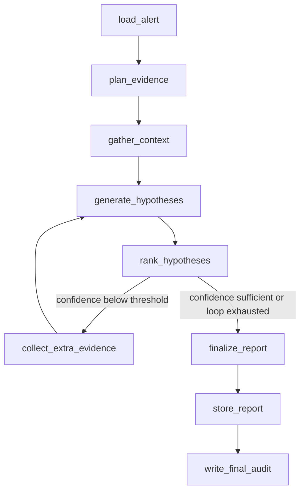

####
## Supervisor-Lite Agent Architecture for Agentic Data Quality Triage
## Author: Mario Caesar // hello@caesarmar.io // https://caesarmar.io/
####

# Supervisor-Lite Agent Architecture

This project uses a supervisor-lite LangGraph workflow, not a fully autonomous boss and child agent system.

The design goal is simple. The agent should investigate data quality incidents with evidence, keep handoffs auditable, and avoid uncontrolled remediation. Specialist behavior exists as graph nodes that share one explicit state object, `TriageState`.

## Why Supervisor-Lite

A full multi-agent system would add orchestration overhead before the core reliability flow is mature. For this project, the senior signal comes from deterministic data quality checks, guarded SQL, lineage evidence, alert lifecycle, approval gates, and audit logs.

Supervisor-lite is the better current design because it keeps the system explainable.

- One LangGraph workflow owns the investigation sequence.
- Specialist nodes own narrow responsibilities.
- `TriageState` is the shared context and handoff contract.
- Every tool call writes audit data.
- Remediation remains approval-gated.
- LLM usage is optional and routed through provider-aware config.

## Runtime Flow

## Specialist Nodes

| Node | Specialist | Main Responsibility | Main Tools |
| --- | --- | --- | --- |
| `load_alert` | Alert Context Specialist | Load and normalize one alert from ClickHouse. | `agent.tools.alerts` |
| `plan_evidence` | Evidence Planning Specialist | Produce a typed category plan; deterministic policy adds required evidence before any tool runs. | `llm_router`, `agent.planning.evidence` |
| `gather_context` | Evidence Collection Specialist | Collect SQL, DQ history, pipeline run, and lineage evidence. | `clickhouse_sql`, `dq_history`, `pipeline_runs`, `dbt_lineage` |
| `generate_hypotheses` | Hypothesis Generation Specialist | Build policy-owned candidates, then apply bounded model wording grounded in evidence IDs. | `build_hypotheses_for_state`, `agent.reasoning.hypotheses`, `llm_router` |
| `rank_hypotheses` | Hypothesis Ranking Specialist | Sort hypotheses and route the evidence loop. | `TriageState.top_hypothesis` |
| `collect_extra_evidence` | Extra Evidence Specialist | Run bounded additional evidence collection when confidence is low. | `clickhouse_sql` |
| `finalize_report` | Report Writing Specialist | Build Markdown and JSON report content with optional LLM narrative. | `llm_router`, `build_report_from_state` |
| `store_report` | Artifact Storage Specialist | Store report artifacts and update alert lifecycle. | `s3_artifacts`, `alert_lifecycle` |
| `write_final_audit` | Audit Specialist | Write final completion audit event to ClickHouse. | `agent_audit_log` |

## Handoff Contract

Every node reads and writes `TriageState`. This keeps context sharing explicit and inspectable.

Important fields:

- `alert`
- `evidence_plan`
- `evidence`
- `hypotheses`
- `hypothesis_framing`
- `evidence_iterations`
- `report`
- `audit_events`
- `errors`

The workflow should not pass hidden memory between nodes. If a later node needs context, it must exist in `TriageState` as an auditable field.

## LLM Boundary

The LLM is not the orchestrator. It is an optional narrative or reasoning helper behind the model routing layer.

For evidence planning, the model can return only a typed `EvidencePlanProposal`. Deterministic policy adds required categories, corrects unsafe priority order, and `gather_context` maps those categories through a hardcoded collector allowlist. The model cannot provide SQL, shell commands, dynamic tool names, credentials, or remediation execution.

For hypothesis framing, the model can return only a typed `HypothesisFramingProposal` referencing deterministic candidate categories and existing evidence IDs. The model may improve the operator-facing title, explanation, evidence rationale, and review-oriented action wording. Deterministic code owns confidence and ranking, restores omitted candidates, filters invented evidence IDs, and replaces executable or unsafe action text.

The current routing design supports:

- heuristic fallback for local demos without API keys
- OpenAI-compatible providers through `base_url`
- cheap, mid, and stronger reasoning routes
- token and cost logging per call

If an LLM call fails or credit is unavailable, the graph records route metadata and continues with deterministic evidence and hypothesis wording.

## Remediation Boundary

The agent may recommend remediation, but it must not execute risky actions directly.

Allowed as recommendations:

- trigger Airflow backfill dispatcher
- rerun dbt
- rerun DQ checks
- create ticket
- post notification
- acknowledge or resolve alert

Execution must remain approval-gated through Streamlit, Discord, Airflow manual trigger, or future MCP commands.

## Why Not Full Boss And Child Agents Yet

Full multi-agent orchestration is intentionally deferred.

Current risks if implemented too early:

- harder debugging
- duplicated context
- unclear ownership between agents
- higher token cost
- more failure modes in local demo
- weaker audit trail if handoffs are implicit

The upgrade path is to split the existing node functions into specialist modules first, then expose the same tools through MCP. Only after that should true multi-agent delegation be considered.

## Upgrade Path

1. Keep current LangGraph as the single supervisor.
2. Keep specialist node implementations under `agent/nodes/`; split `triage_nodes.py` into narrower modules only when the graph grows.
3. Keep `TriageState` as the only shared context contract.
4. Add MCP tools that reuse the same guarded tools.
5. Add eval scenarios for each incident type.
6. Consider multi-agent routing only when the tool surface and eval harness are stable.

