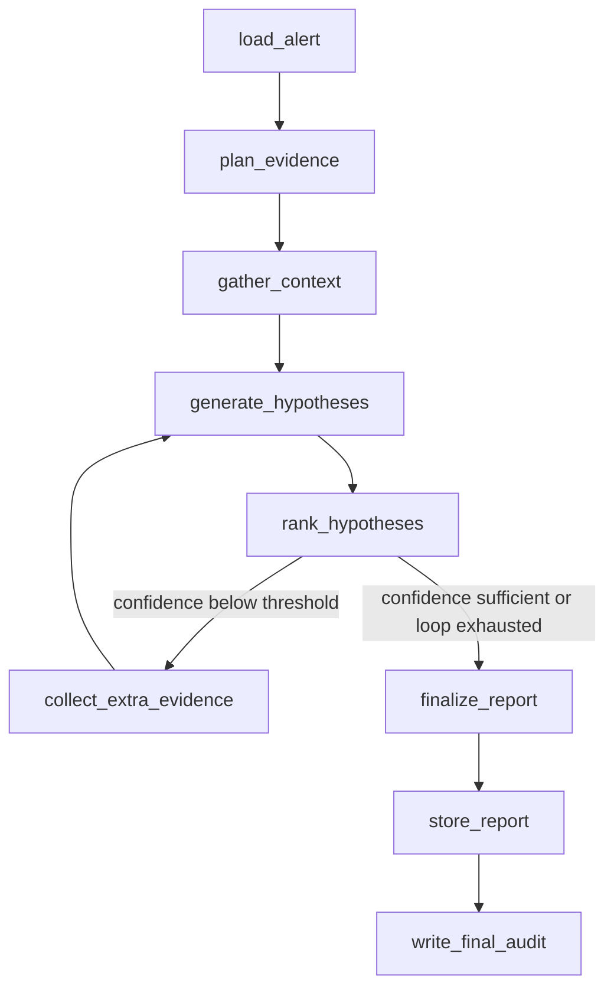
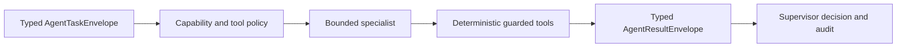
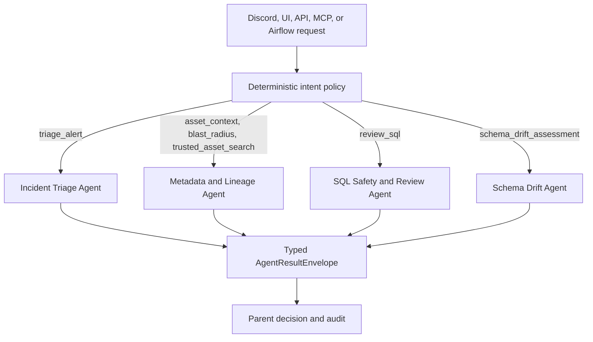
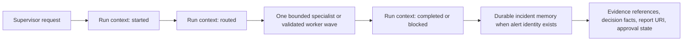

####
## Supervisor-Lite Agent Architecture for Agentic Data Quality Triage
## Author: Mario Caesar // hello@caesarmar.io // https://caesarmar.io/
####

# Supervisor-Lite Agent Architecture

This project uses a supervisor-lite LangGraph workflow with an opt-in bounded fan-out runtime, not a fully autonomous boss and child agent system.

The design goal is simple. The agent should investigate data quality incidents with evidence, keep handoffs auditable, and avoid uncontrolled remediation. Triage specialist behavior exists as graph nodes that share one explicit state object, `TriageState`. The first cross-agent pilot uses separate typed task and result envelopes rather than sharing hidden conversation memory.

## Why Supervisor-Lite

A full multi-agent system would add orchestration overhead before the core reliability flow is mature. For this project, the senior signal comes from deterministic data quality checks, guarded SQL, lineage evidence, alert lifecycle, approval gates, and audit logs.

Supervisor-lite is the better current design because it keeps the system explainable.

- One LangGraph workflow owns the investigation sequence.
- Specialist nodes own narrow responsibilities.
- `TriageState` is the shared context and handoff contract.
- Every tool call writes audit data.
- Remediation remains approval-gated.
- LLM usage is optional and routed through provider-aware config.

## Runtime Flow

## Specialist Nodes

| Node | Specialist | Main Responsibility | Main Tools |
| --- | --- | --- | --- |
| `load_alert` | Alert Context Specialist | Load and normalize one alert from ClickHouse. | `agent.tools.alerts` |
| `plan_evidence` | Evidence Planning Specialist | Produce a typed category plan; deterministic policy adds required evidence before any tool runs. | `llm_router`, `agent.planning.evidence` |
| `gather_context` | Evidence Collection Specialist | Collect alert-specific SQL, DQ history, pipeline run, lineage, and schema drift evidence. | `clickhouse_sql`, `dq_history`, `pipeline_runs`, `dbt_lineage`, `schema_drift` |
| `generate_hypotheses` | Hypothesis Generation Specialist | Build policy-owned candidates, then apply bounded model wording grounded in evidence IDs. | `build_hypotheses_for_state`, `agent.reasoning.hypotheses`, `llm_router` |
| `rank_hypotheses` | Hypothesis Ranking Specialist | Sort hypotheses and route the evidence loop. | `TriageState.top_hypothesis` |
| `collect_extra_evidence` | Extra Evidence Specialist | Retry one bounded alert-specific evidence source when confidence is low. | `clickhouse_sql`, `schema_drift` |
| `finalize_report` | Report Writing Specialist | Build Markdown and JSON report content with optional LLM narrative. | `llm_router`, `build_report_from_state` |
| `store_report` | Artifact Storage Specialist | Store report artifacts and update alert lifecycle. | `s3_artifacts`, `alert_lifecycle` |
| `write_final_audit` | Audit Specialist | Write final completion audit event to ClickHouse. | `agent_audit_log` |

## Handoff Contract

Every node reads and writes `TriageState`. This keeps context sharing explicit and inspectable.

Important fields:

- `alert`
- `evidence_plan`
- `evidence`
- `hypotheses`
- `hypothesis_framing`
- `evidence_iterations`
- `report`
- `audit_events`
- `errors`

The workflow should not pass hidden memory between nodes. If a later node needs context, it must exist in `TriageState` as an auditable field.

## Bounded Specialist Pilot

The first specialist outside the triage graph is `metadata_lineage_agent`. It is intentionally deterministic and read-only. The existing triage graph is also exposed through a typed `incident_triage_agent` wrapper; the graph itself is reused rather than copied or rewritten. The third specialist, `sql_safety_review_agent`, reviews a SQL proposal against deterministic policy without executing the proposal. The fourth specialist, `schema_drift_agent`, assesses one exact persisted detector run and one table without rerunning detection or changing the warehouse schema.

The metadata specialist supports three allowlisted tasks:

- `asset_context` combines metadata ownership, grain, SLA, direct lineage, and bounded blast radius.
- `blast_radius` returns metadata context plus bounded transitive downstream impact.
- `trusted_asset_search` searches the metadata registry without receiving lineage-tool permissions.

Metadata handoffs have an exact tool allowlist, deterministic `no_llm_fallback` routing, zero model cost, a timeout, an explicit requester, and a parent run ID. Incident handoffs use a policy-owned `deepthinkllm` capability ceiling while the child graph separately records requested, executed, and fallback provider routes. Start, completion, rejection, and failure events are written to `dq.agent_audit_log`. Tool failures return a failed result envelope instead of contaminating downstream supervisor state.

The SQL review specialist accepts only the `review_sql` task. It applies the existing read-only SQL guardrails, mandatory date-filter policy, hard `LIMIT`, metadata trust checks, and a conservative active-part scan estimate from ClickHouse. The result records an `approved` or `rejected` review decision, query risk, findings, evidence references, and the proposal hash. An approved review means only that the proposal passed the configured review policy; it does not execute or authorize execution. Raw SQL execution remains exclusively inside `agent.tools.clickhouse_sql.run_guarded_sql`, which is not in the specialist allowlist.

Airflow transports the proposal as Base64 so multiline SQL is not interpreted by the shell boundary. This is transport encoding, not encryption or a secrecy control. Audit events use the proposal hash and structured policy result rather than storing raw SQL in `output_json`.

The schema drift specialist accepts only the `assess_schema_drift` task. Its input must include an exact schema detector `run_id` and qualified table name. The specialist combines persisted comparison evidence from `dq.schema_snapshots` and `dq.schema_drift_results` with metadata trust context and a bounded dbt blast radius. Deterministic policy returns `compatible`, `review_required`, or `breaking_change`, together with impact, evidence references, and a non-executing migration plan.

Schema detection remains owned by the deterministic pipeline and `96_dag_dq_schema_drift_detection`. The specialist cannot rerun the detector, execute DDL, alter a table, or apply a migration. Every result enforces `execution_performed=false`; clean detector runs remain valid evidence with zero findings.

The pilot does not introduce a free-running boss agent. `SupervisorState` now has a manual runtime boundary, but it is not the default application runtime.

## Manual Control Plane Pilot

`98_dag_dq_control_plane_supervisor_smoke` is the Airflow acceptance boundary for the bounded four-specialist pilot.

The current pilot applies these controls:

- exactly one specialist handoff per request
- deterministic intent classification and specialist selection
- specialist capability registry and task-specific tool allowlists
- parent handoff, retry, external model-call, token, estimated-cost, and latency budgets
- pre-handoff worst-case admission checks and post-handoff actual-usage reconciliation
- one run-scoped LLM ledger that counts provider fallback and structured-output compatibility attempts
- hidden provider SDK retries disabled while a supervisor ledger is active
- failed provider attempts retained conservatively; pure heuristic routes consume zero external-call budget
- hard process-signal deadlines that interrupt specialist work in the Airflow Linux runtime
- capability-registry retry eligibility for transient failures on read-only specialists only
- append-only ClickHouse circuit state with bounded history, cooldown, and a half-open probe
- typed partial-result acceptance with no automatic second handoff in the default single-execution mode
- child failure isolation with no uncontrolled domino failure
- parent-correlated start, route, completion, failure, and final-decision audit events
- explicit human approval state for proposed remediation
- proposal-hash, table-trust, date-filter, hard-limit, and estimated-scan evidence for SQL review
- explicit `execution_performed=false` enforcement for every SQL review result
- exact detector-run correlation, snapshot-integrity validation, and bounded lineage impact for schema assessment
- zero-token and zero-cost `no_llm_fallback` routing for deterministic schema assessment
- explicit `execution_performed=false` enforcement for every schema assessment result
- no direct SQL mutation or remediation execution

The pilot supports explicit intents and bounded auto-classification. A supplied SQL proposal routes deterministically to `review_sql`; an exact schema detector run routes to `schema_drift_assessment`; ambiguous auto requests are blocked instead of guessed. Airflow verifies the parent audit, circuit decision, exact attempt lifecycle, pre-handoff admission decision, post-handoff usage reconciliation, specialist audit, child triage audit when applicable, SQL review decision when applicable, exact schema source run and assessment when applicable, report URI, and absence of forbidden SQL execution, schema mutation, or remediation actions before the DagRun can succeed.

## Specialist Result Contract Boundary

The capability registry validates both sides of every handoff. A result must match the source task's task ID, parent run ID, specialist, and task type before the parent can accept it. Result envelopes are terminal-only; in-flight `pending` and `running` states remain handoff lifecycle records rather than child outcomes.

Every currently enabled specialist requires deterministic evidence for `success` and `partial` results. Evidence may reference only tools explicitly granted to the source task. The result may use the task's policy-selected capability or a weaker proven route, including `no_llm_fallback`, but it cannot exceed that ceiling. A deterministic task cannot promote itself to an LLM route. Reported duration must also remain inside the source task timeout.

Malformed identity, missing evidence, unauthorized evidence tools, route escalation, and timeout contradictions fail before the result enters parent state or durable incident memory. Error messages remain bounded, unique, and single-line. Failed and blocked results carry zero confidence, while partial results must retain an explicit error describing the incomplete portion. Aggregate provider usage can still be recorded above a task estimate so the post-handoff budget gate can preserve the overrun as audit evidence and reject it honestly.

## Runtime Budget Boundary

The parent request owns six independent limits: handoffs, specialist retries, external model calls, tokens, estimated provider cost, and latency. The supervisor first compares the specialist's declared worst-case budget with the remaining parent budget. A rejected admission does not invoke the specialist and is retained as a blocked budget decision.

During an accepted LLM-capable handoff, a context-local ledger reserves one call before every external provider request. Provider fallback and the single structured-output compatibility retry therefore consume separate calls. Successful requests reconcile conservative token and cost reservations with normalized usage. Failed requests keep their reservation so a provider error cannot make the run appear cheaper than it was. Pure heuristic execution does not consume external-call, token, or provider-cost budget.

After the specialist returns, the supervisor reconciles the child result with the ledger and checks actual aggregate usage before accepting the result into parent state or durable incident memory. An over-budget child result remains available in append-only audit evidence but cannot become an accepted parent result or trigger remediation.

## Failure Containment Boundary

The parent runtime applies one absolute deadline across every attempt. Airflow executes the supervisor inside Linux, where a POSIX process signal interrupts blocking specialist work in the current process. The timeout signal inherits from `BaseException`, so a broad specialist `except Exception` block cannot silently swallow cancellation. A runtime that cannot provide this hard-cancellation boundary fails closed before specialist work starts. The design intentionally avoids background-thread cancellation because cancelling a future does not stop already-running Python work.

Automatic retries are narrower than the parent retry budget. A specialist must be marked `retry_safe` in the capability registry, must not have mutation permission, and may have only append-only audit side effects. The supervisor retries recognized transient connection or dependency failures, reuses the same task ID, applies bounded deterministic backoff, and never crosses the original absolute deadline. The Incident Triage Agent remains non-retryable because it writes report artifacts and updates alert lifecycle state.

Before a handoff, the supervisor reads a bounded window of recent `supervisor_specialist_outcome` events from `dq.agent_audit_log`. Three consecutive failed or timed-out outcomes open the circuit. The open state blocks specialist invocation until cooldown; after cooldown, one policy-visible half-open probe is allowed. A successful or explicit partial outcome resets the consecutive failure sequence. This append-only audit approach is sufficient for the current single-active-run pilot; a distributed half-open lease is still required before concurrent API traffic can use this runtime.

A specialist may return `partial` only through the typed result envelope. The parent retains its usable evidence, explicit errors, and recommended next step, marks the failure as isolated, and does not start another specialist. Timeout output is never accepted into parent state or durable incident memory. Circuit-open requests create no child execution. Every circuit check, attempt start, attempt failure, timeout, retry schedule, attempt completion, terminal specialist outcome, and final decision remains correlated by the parent run ID.

### Supervisor Audit Completeness Contract

The parent emits `supervisor_handoff_started` before an accepted specialist invocation. It then emits exactly one terminal parent handoff event. `supervisor_handoff_completed` records a typed terminal result, `supervisor_handoff_failed` records an attempted invocation that did not produce a terminal result, and `supervisor_handoff_rejected` records a policy or circuit decision that prevented invocation. Every event retains the same parent run ID and task ID, while attempt events use explicit one-based attempt numbers.

The terminal specialist outcome is considered written only after the append-only audit writer succeeds. If that append fails, the supervisor writes one bounded fallback outcome instead of silently skipping terminal evidence. Final parent decisions include the approval state and resilience summary. SQL review requests retain a proposal hash in audit storage but never copy raw SQL into supervisor JSON payloads.

`99_dag_dq_control_plane_resilience_smoke` is the manual Airflow acceptance boundary for five allowlisted scenarios: one transient retry, hard timeout, open-circuit rejection, usable partial result, and terminal specialist failure. Each scenario executes and then verifies exact ClickHouse audit counts, typed JSON envelopes, parent correlation, attempt and retry counters, terminal handoff classification, run-context phases, accepted-result boundaries, and absence of incident-memory or remediation side effects. `98_dag_dq_control_plane_supervisor_smoke` remains the normal one-handoff acceptance path.

## Run Context And Durable Incident Memory

The Control Plane Supervisor separates temporary investigation state from durable incident facts. This avoids treating unrestricted conversation history as memory and keeps every cross-agent handoff replayable from typed references.

`dq.agent_run_context_events` stores the active investigation lifecycle. It records deterministic event IDs, the parent and external Airflow run IDs, selected specialist, task type, typed context and evidence references, bounded decision facts, report URI, and approval state. Each row has a content hash and a 30-day ClickHouse TTL. The supervisor writes `started`, `routed`, and terminal `completed` or `blocked` phases so an interrupted or contained run remains observable without persisting hidden prompts or raw tool output.

`dq.incident_memory` stores one idempotent, durable investigation outcome when an alert identity is available. The record keeps the human-facing Alert Ref, internal alert key, outcome, specialist, evidence references, bounded decision facts, report URI, approval state, optional resolution reference, and a content hash. Metadata, SQL review, and schema assessment requests without an alert do not create incident memory.

The memory boundary explicitly rejects hidden prompts, unrestricted conversation history, credentials, environment state, raw SQL, and raw tool output. It stores references and bounded facts instead of duplicating full evidence payloads. ClickHouse and SeaweedFS remain the durable stores; no vector database is required for this stage.

The read path is deliberately narrower than the persistence model. `GET /api/v1/incidents/history` requires one exact Alert Ref, system key, or alert UUID, applies a mandatory recent window and hard row limit, and exposes only operator-safe identity, outcome, confidence, root-cause category, report reference, approval state, and bounded evidence pointers. Raw decision JSON, content hashes, memory keys, SQL, tool output, and conversation state remain internal. Streamlit consumes the same shared client contract in its `Previous Investigations` panel, shows the human Alert Ref and report reference first, and keeps correlation UUIDs and the system alert key inside a collapsed technical section.

The triage graph also reads this durable history through the `incident_history` collector before creating the current outcome. The collector uses the canonical alert identity, a mandatory lookback, and a hard limit; returns only sanitized summaries, likely-cause categories, confidence, evidence type/count metadata, approval state, and report links; and writes one `fetch_incident_history` audit event containing boundaries, result counts, and a SQL hash. Previous outcomes are comparison evidence only. They cannot override current DQ, pipeline, lineage, schema, or guarded SQL evidence, and the current run is not visible until its terminal memory record is written after triage.

The supervisor keeps only persisted context and memory IDs in `SupervisorState`. `98_dag_dq_control_plane_supervisor_smoke` verifies lifecycle phases, TTL, content hashes, exact audit correlation, report linkage, and the required incident-memory record for triage before an operational DagRun can succeed. A persistence failure after a specialist completes is contained as a partial parent result and cannot trigger another specialist handoff.

## LLM Boundary

The LLM is not the orchestrator. It is an optional narrative or reasoning helper behind the model routing layer.

For evidence planning, the model can return only a typed `EvidencePlanProposal`. Deterministic policy adds required categories, including bounded incident history, corrects unsafe priority order, and `gather_context` maps those categories through a hardcoded collector allowlist. The model cannot provide SQL, shell commands, dynamic tool names, credentials, or remediation execution.

For hypothesis framing, the model can return only a typed `HypothesisFramingProposal` referencing deterministic candidate categories and existing evidence IDs. The model may improve the operator-facing title, explanation, evidence rationale, and review-oriented action wording. Deterministic code owns confidence and ranking, restores omitted candidates, filters invented evidence IDs, and replaces executable or unsafe action text.

The current routing design supports:

- heuristic fallback for local demos without API keys
- OpenAI-compatible providers through `base_url`
- cheap, mid, and stronger reasoning routes
- token and cost logging per call

Supervisor routing and provider routing are intentionally separate policies. The
supervisor selects a specialist and capability route from typed request context;
callers cannot submit their own `model_route`. Metadata, lineage, SQL review, and
schema assessment tasks remain deterministic `no_llm_fallback` work with zero model
budget. Incident triage receives a policy-owned `deepthinkllm` capability ceiling;
this authorizes strong reasoning but does not claim that a strong route ran. Normal
triage narrative is recorded as `quickthinkllm`, while a strong route is recorded as
`deepthinkllm` only when an external `low_confidence_rca` execution succeeds. Low-risk
Discord and UI wording uses the `cheap_summary` provider route with a bounded fallback
chain that terminates at the local heuristic provider.

Current routing tests also prove that changing a task to a stronger model cannot
bypass the specialist risk ceiling, and any recommended operational action still
enters the human-approval boundary. After the bounded evidence loop, confidence below
the configured threshold automatically requests `low_confidence_rca`. The same strong
route is requested when deterministic incident complexity is high, even when top
confidence is otherwise sufficient. Requested and executed routes, provider, model,
fallback reason, and proven capability are retained separately. A fallback from strong
to normal or heuristic reasoning does not satisfy strong review; the terminal policy
raises effective risk and assigns pending human review instead.

Incident complexity is an additive, deterministic policy rather than an LLM opinion or
caller parameter. Critical severity contributes only one weak point and cannot select a
strong route by itself. Cross-signal facts contribute stronger weight: close competing
hypotheses, explicit evidence contradictions, four or more directly related lineage
assets, persisted warning/failure schema findings, or unresolved investigation errors. Evidence breadth
is counted only from guarded SQL, DQ history, incident history, pipeline runs, dbt
lineage, and schema drift. Narrative notes cannot inflate the score. The typed report
persists tier, score, reasons, evidence-type breadth, hypothesis gap, contradiction
count, lineage count, schema finding count, and unresolved error count for audit and
replay.

If an LLM call fails or credit is unavailable, the graph records route metadata and continues with deterministic evidence and hypothesis wording.

## Bounded Multi-Agent Runtime V2

The optional fan-out runtime expands evidence collection without changing the
default control boundary. `execution_mode=single` remains the default. A manual
operator may request `execution_mode=fanout`, but the caller cannot select a
provider, model, tool permission, or mutation capability.

The runtime uses these typed contracts:

- `AgentExecutionPlan` records the immutable parent identity, worker tasks,
  dependencies, policy limits, execution waves, aggregation strategy, and plan
  hash.
- `PlannedAgentTask` records one stable child identity, allowlisted specialist
  task, required or optional classification, exact tool permissions, context
  references, timeout, retry, and model budget.
- `AgentExecutionWave` records dependency-safe workers that may execute in
  parallel.
- `AgentAggregationResult` records accepted evidence, required and optional
  failures, missing evidence, usage totals, and the parent outcome.

The planner boundary is intentionally asymmetric. Gemini may propose an
allowlisted typed plan in a future manual path, but deterministic policy always
validates the plan, inserts mandatory evidence, removes duplicate work, rejects
cycles and unavailable capabilities, strips unauthorized tools, clamps worker
count and concurrency, assigns model routes, and produces the immutable plan
hash. The model proposes; the supervisor validates and spawns.

Execution uses LangGraph `Send` for dynamic worker dispatch and a reducer for
fan-in. The runtime permits at most ten workers and defaults to three concurrent
workers. This limit represents scoped worker capacity, not ten independent
personas. Safe workers are read-only evidence tasks such as metadata context,
lineage, blast radius, schema assessment, DQ history, pipeline history, incident
history, and guarded SQL evidence. Hypothesis ranking, evidence synthesis, SQL
review, remediation planning, approval, and Airflow execution remain sequential.

Every worker receives a stable task ID, parent correlation, dedicated checkpoint
namespace, typed context references, exact tool allowlist, and bounded resource
allocation. Workers do not receive credentials, unrestricted conversation
history, hidden prompts from siblings, or arbitrary environment state. A
thread-safe parent allocator reserves model calls, tokens, estimated cost, and
latency before provider execution.

Failure semantics preserve valid sibling evidence. An optional worker failure
produces a partial parent result. A required worker failure blocks a
high-confidence conclusion. Timed-out or failed workers cannot write durable
incident conclusions or trigger remediation. Completed workers can be reused
from checkpoint evidence during resume, and new provider work is blocked before
execution when the shared budget or circuit policy rejects it.

The current accepted pilot is deterministic and read-only:

- DAG: `98_dag_dq_control_plane_supervisor_smoke`
- Run: `manual__fanout_acceptance_20260901T202600`
- Workers: `2`
- Default concurrency ceiling: `3`
- External model calls, tokens, and estimated cost: `0`
- Final DagRun state: `success`

This proves typed fan-out, aggregation, parent/worker audit correlation, and
backward-compatible manual orchestration. It does not prove that external-LLM
fan-out improves triage quality. That activation remains gated by Airflow
resilience acceptance and LIFE comparison against the same incident ground
truth.

## Remediation Boundary

The agent may recommend remediation, but it must not execute risky actions directly.

Allowed as recommendations:

- trigger Airflow backfill dispatcher
- rerun dbt
- rerun DQ checks
- create ticket
- post notification
- acknowledge or resolve alert

Execution must remain approval-gated through Streamlit, Discord, Airflow manual trigger, or future MCP commands.

## Why Not Unrestricted Boss And Child Agents

Unrestricted recursive agent spawning remains intentionally excluded.

Current risks if implemented too early:

- harder debugging
- duplicated context
- unclear ownership between agents
- higher token cost
- more failure modes in local demo
- weaker audit trail if handoffs are implicit

The bounded worker runtime is deliberately narrower than unrestricted delegation. It preserves typed contracts, explicit dependencies, deterministic policy, budget reservation, failure isolation, and human approval while still demonstrating parallel specialist execution.

## Upgrade Path

1. Keep the current triage LangGraph and single-handoff supervisor as the default runtime.
2. Keep `AgentTaskEnvelope` and `AgentResultEnvelope` at cross-agent boundaries; keep `TriageState` internal to triage.
3. Acceptance-test checkpoint reuse, audit completeness, budget contention, timeout, rate-limit, invalid-contract, and partial aggregation behavior through DAG 99.
4. Compare single and fan-out evidence coverage, confidence, latency, and cost against the same LIFE incident ground truth.
5. Keep runtime concurrency at three even though the hard worker capacity is ten.
6. Keep SQL review separate from SQL execution and require a new approval-gated execution request if execution is added later.
7. Keep mutation behind human approval and the Airflow or API execution boundary.
8. Do not make fan-out the default until measured benefit exceeds its added latency, cost, and operational complexity.

